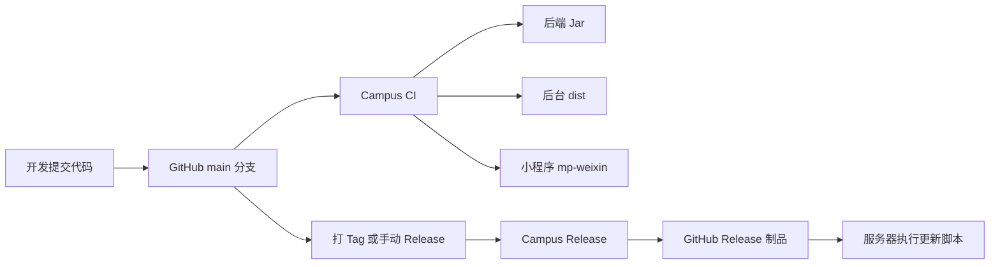

# 代码提交、自动打包与可视化更新方案

## 目标

提交代码后，GitHub 自动完成后端、后台前端、小程序端的打包，并在 GitHub Actions 页面可视化展示构建状态、日志和下载产物。后续发版时，通过 GitHub Release 生成固定版本制品，服务器按制品更新。

## 当前方案



## 可视化入口

- 构建看板：仓库顶部 `Actions`
- 每次提交状态：仓库首页提交记录旁边的绿色/红色状态图标
- 打包产物：进入某次 `Campus CI` 运行，下载 `Artifacts`
- 版本发布：仓库右侧或顶部 `Releases`

## 自动打包

Workflow 文件：

```text
.github/workflows/campus-ci.yml
```

触发条件：

- 推送到 `main`
- 向 `main` 发起 Pull Request
- 在 Actions 页面手动运行

打包内容：

- `campus-backend-jar`：后端 `yudao-server` Jar
- `campus-admin-ui-dist`：后台 Vue3 静态文件
- `campus-miniapp-mp-weixin`：微信小程序构建产物

## 版本发布

Workflow 文件：

```text
.github/workflows/campus-release.yml
```

触发方式一：打 tag。

```powershell
git tag v0.1.0
git push origin v0.1.0
```

触发方式二：在 GitHub Actions 里手动运行 `Campus Release`，输入版本号，例如 `v0.1.0`。

Release 产物：

- `campus-backend.jar`
- `campus-admin-ui-dist.tar.gz`
- `UPDATE_PIPELINE.md`

## 自动部署到服务器

Workflow 文件：

```text
.github/workflows/campus-deploy.yml
```

当前服务器：

```text
ssh://root@121.43.83.21:22
```

GitHub 配置入口：

```text
Repository -> Settings -> Secrets and variables -> Actions -> New repository secret
```

推荐使用 SSH 私钥，新增：

```text
SERVER_SSH_KEY=服务器 root 用户可登录的私钥内容
```

如果暂时只有密码，也可以新增：

```text
SERVER_PASSWORD=服务器 root 密码
```

部署入口：

```text
Repository -> Actions -> Campus Deploy -> Run workflow
```

执行后会自动完成：

```text
打包后端 Jar -> 打包后台 dist -> 上传到服务器 /tmp -> 更新 /opt/campus-platform -> 重启后端 -> reload nginx
```

## 服务器更新模板

脚本路径：

```text
scripts/deploy/update-server.sh
```

服务器上下载 Release 产物后执行：

```bash
chmod +x scripts/deploy/update-server.sh
APP_HOME=/opt/campus-platform \
BACKEND_SERVICE=campus-platform.service \
./scripts/deploy/update-server.sh
```

默认目录：

```text
/opt/campus-platform/
├── backend/app.jar
├── admin/dist
└── releases/
```

## 推荐权限流程

- 开发成员给 `Write` 权限。
- 日常开发走分支和 Pull Request。
- `main` 只合并通过 CI 的代码。
- 正式上线使用 `v*` 标签触发 Release。

## 后续可升级

1. 增加服务器 SSH 自动部署：在 GitHub Secrets 配置服务器 IP、用户、私钥。
2. 增加 Docker 镜像构建：推送到 GitHub Container Registry 或阿里云镜像仓库。
3. 增加数据库迁移：把 SQL 变更纳入 Flyway / Liquibase。
4. 增加部署环境：`dev`、`test`、`prod` 分环境审批上线。
5. 增加通知：构建失败自动通知企业微信或钉钉。
